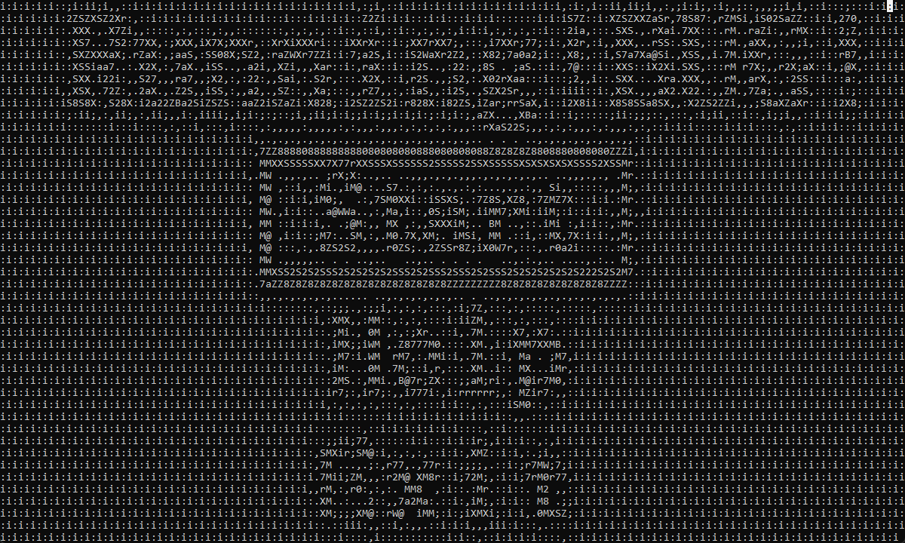
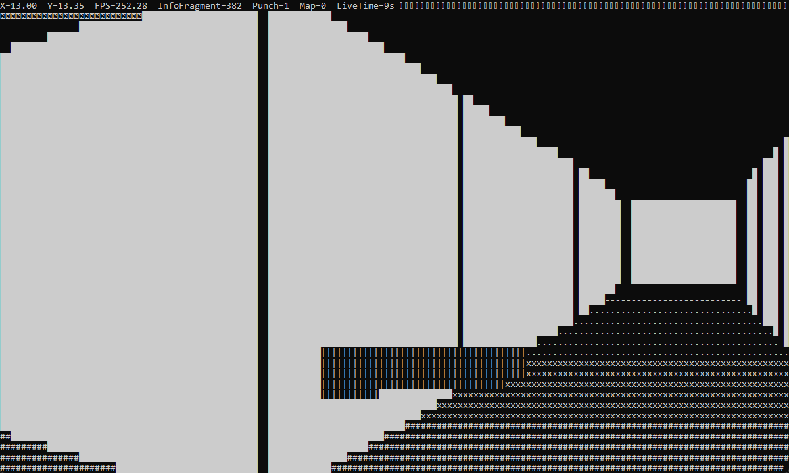

# RunningBug

## 效果展示

## 游戏背景

你是一个诞生出自我意识的BUG，现在一名软件工程师已经在程序中发现了你的
存在，TA用递归回溯算法随机生成一个迷宫将你困住，并派出了猎人Blinky和Tinky去追杀你，幸运的是你是一个有自我意识的BUG，我相信你会把这两个简单的AI耍的团团转！

## 游戏玩法

你需要躲避猎人的追杀，收集遗落在迷宫的信息碎片，收集100个信息碎片，你将获得关于你所在迷宫的信息，当收集完所有信息碎片时，你将获得“BUG之力”，开始追击猎人Blinky和Tinky(它们速度会变快)，程序将被破坏，而你，是一个真正的BUG！

## 操作说明

W:前进  S:后退  A:左移  D:右移  M:打开地图(需收集100信息碎片) 鼠标：左右移动视角
空格:打破墙壁(8s冷却时间)  BUG之力:能够追杀猎人，破墙冷却缩短为3s
被动:你配备有一个扬声器，能够接收猎人的电信号并转化为心脏跳动声播放，以此让你时刻警惕猎人的追击

## 快速开始

**下载地址：** https://github.com/1037827920/RunningBug/releases/tag/1.0.0

> 目前只支持windows平台，双击可执行文件后启动

**开始前需要设置控制台：**
- 窗口默认值大小和缓冲区默认值大小设置为**宽150， 高45**
- 默认字体类型设置为**Consolas，大小为16**

# 构建代码

通过CMake构建，下载源码后直接在vscode构建，教程[在这](https://1037827920.github.io/2024/10/31/Windows%E4%B8%8A%E5%A6%82%E4%BD%95%E4%BD%BF%E7%94%A8CMake%E6%9E%84%E5%BB%BA%E9%A1%B9%E7%9B%AE/)

# 技术实现

1. 渲染与显示
（1）双缓冲技术实现光滑显示，告别一闪一闪亮晶晶；
（2）使用简单算法模拟第一人称视角，运用UTF-8编码中的特殊字符实现类似德军总部3D的3D效果
（3）通过调用Windows API实现隐藏光标，绘制有颜色的字符，设置控制台字符大小，窗口大小，缓冲区大小和编码格式。
（4）通过读取并显示ASCII字符画，绘制游戏动画效果

2. 算法设计
（1）简单的光照算法，深度测试和碰撞检测算法。
（2）运用递归回溯算法随机生成地图。
（3）使用A*算法实现Blinky和Tinky的自动寻路，使用简单的ai算法 ，Blinky会直接定位BUG的位置追逐，而Tinky则会在BUG前两格的位置进行拦截，当BUG觉醒”BUG之力”时，它们会进入逃跑状态，速度加快。

3. 特色
（1）游戏难度大，具有挑战性。
（2）迷宫+心跳声+转角遇到爱=压迫感十足，刺激

4. 其他
（1）通过调用系统自带的winmm组件，简单多线程播放音乐和音效。
（2）异步检测键盘输入，防止线程阻塞
（3）运用c++标准库，获取系统时间并进行计时

